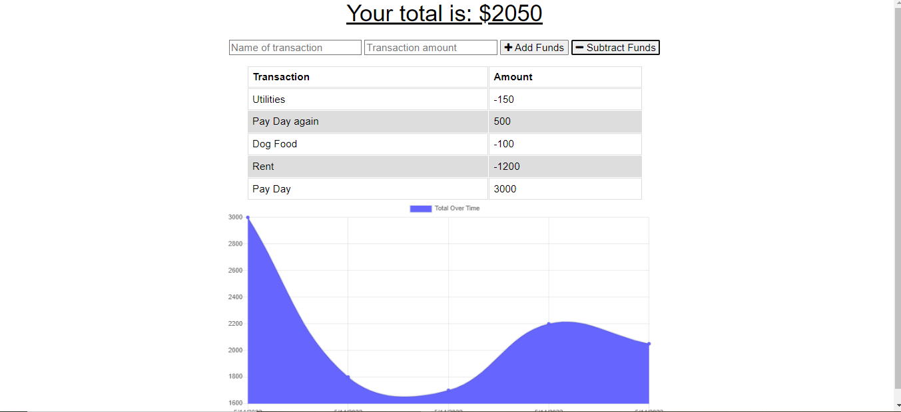

# Budget Bucket

## DESCRIPTION

> To create a PWA.
> That allows users offline functionality and ease of use.
> So that users are not restricted to wifi/good signal for a successful application.

## INSTALLATION

> The install button at the corner of the url bar

## USAGE

An online or offline budgeting tool that is mobile-friendly.

## LANGUAGES & TECHNOLOGIES

> JavaScript,ES6,Bootstrap,Node and Mongoose, Express, MongoDB, Heroku

## AUTHOR(S)

>

- [Jacob Ambrose](https://www.github.com/jambrose0)
  >

## LICENSE

## PREVIEW

> 
